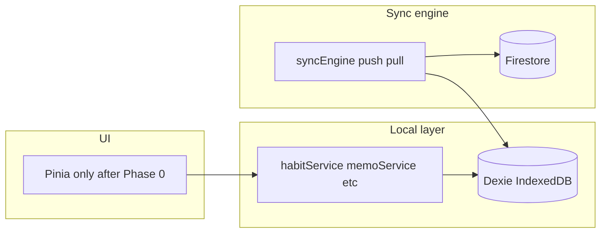

# IndexedDB + Pinia → Firestore sequential sync

## Phases for version control

Each phase is intended to merge independently: **later phases depend on earlier ones**, but no phase should require unfinished work from a future phase. Tag or release after each phase if you want traceable rollbacks (e.g. `v-sync-phase-1`).

| Phase | Goal | Merge when | Depends on |
|-------|------|------------|------------|
| **0** | **Remove Vuex** — Pinia-only app; no `createStore`, no `$store`, no `mapState` / `mapActions` | All routes and dialogs behave as today; `package.json` no longer lists `vuex` or `vuex-persistedstate` | — |
| **1** | **Dexie schema only** — new fields, indexes, one-shot upgrade migration from existing `syncStatus` / default `isDeleted` | App still runs; new columns may be undefined until migration runs — default reads defensively (`!!isDeleted`) | Phase 0 (keeps state layer consistent before sync work) |
| **2** | **Local-first semantics** — every local mutation sets `updatedAt` (ms), `isDirty`; soft deletes + read filters; no new Firestore sync yet | Local UX matches today except deletes become tombstones (UI must hide `isDeleted`) | Phase 1 |
| **3** | **Firebase project config** — composite indexes + security rules (repo file + console deploy) | Indexes building in background; rules deployed before enabling client pull/push in prod | — (can parallel Phase 2 after Phase 1 if desired) |
| **4** | **Sync engine** — `syncEngine` (push/pull, batches, cursor); unit-testable in isolation with mocked Firestore if needed | Feature can ship dark (exported but not started) until Phase 5 | Phases 1–2; Phase 3 before **prod** enable |
| **5** | **App integration** — start/stop engine from [`src/App.vue`](src/App.vue); reconcile [`syncService.js`](src/services/syncService.js) one-shot migration vs incremental pull; optional `syncStore` for UI | Multi-device behavior live | Phases 1–4 |

**Suggested Git workflow:** one branch per phase (e.g. `sync/phase-0-remove-vuex`, `sync/phase-1-dexie`, …) merged sequentially to `main`, or a long-lived `feature/firestore-sync` with phase commits clearly prefixed (`chore: phase 0 — remove vuex`).

**Rollback story:** Phase 5 is the riskiest; keep Phase 4 mergeable without wiring so you can revert only App changes. Phase 2 changes local data shape — backup or accept Dexie upgrade is one-way unless you add downgrade logic. Phase 0 is a large touch surface — merge in isolation so bisect can find Vuex regressions.

---

## Phase 0 — Remove Vuex from the app

**Objective:** Single global state library (**Pinia** only). Eliminate [`src/store/index.js`](src/store/index.js) (Vuex) and all component coupling to `this.$store` / `mapState` / `mapGetters` / `mapActions`.

**Mechanical steps:**

1. **Inventory** — Replace usages across views/components (non-exhaustive list from codebase: [`src/main.js`](src/main.js) `.use(store)`; [`src/views/p1/home-p1.vue`](src/views/p1/home-p1.vue); [`src/views/p1/settings-p1.vue`](src/views/p1/settings-p1.vue); [`src/views/auth/login-page.vue`](src/views/auth/login-page.vue); [`src/components/dialogs/add-memo-dialog.vue`](src/components/dialogs/add-memo-dialog.vue); [`src/components/side-bar.vue`](src/components/side-bar.vue); [`src/components/bottom-nav-bar.vue`](src/components/bottom-nav-bar.vue); [`src/components/calendar-row.vue`](src/components/calendar-row.vue); [`src/views/p2/add-habits-p2.vue`](src/views/p2/add-habits-p2.vue); [`src/views/p2/detail-habit-p2.vue`](src/views/p2/detail-habit-p2.vue); [`src/views/p2/settings-account-p2.vue`](src/views/p2/settings-account-p2.vue); [`src/views/p2/settings-news-p2.vue`](src/views/p2/settings-news-p2.vue); [`src/views/p1/sunnah-p1.vue`](src/views/p1/sunnah-p1.vue); [`src/views/p2/detail-sunnah-p2.vue`](src/views/p2/detail-sunnah-p2.vue); [`src/views/auth/register-page.vue`](src/views/auth/register-page.vue); [`src/views/p1/test-p1.vue`](src/views/p1/test-p1.vue)).
2. **Migrate state and actions** — Move remaining Vuex modules (user, habits, memos, sunnahs, UI flags like `selectedDay`, `hasNewNews`, `selectedHabit`, week memos, etc.) into **existing or new Pinia stores** (you already have [`userStore`](src/store/userStore.js), [`habitStore`](src/store/habitStore.js), [`memoStore`](src/store/memoStore.js), [`uiStore`](src/store/uiStore.js) — extend these rather than duplicating concepts).
3. **Persistence** — Replace [`vuex-persistedstate`](https://github.com/robinvdvleuten/vuex-persistedstate) with Pinia persistence where still needed (manual `localStorage` patterns already exist in `userStore`; mirror for any keys Vuex was persisting).
4. **Adapters** — [`getNotifications`](src/utils/pushNotifications.js) and similar helpers that today accept `this.$store` / Vuex store must accept **Pinia** (pass `useUserStore()` / relevant stores or a thin facade).
5. **Remove packages** — Uninstall `vuex` and `vuex-persistedstate`; delete [`src/store/index.js`](src/store/index.js) once empty of consumers.

**Phase 0 exit criteria:** `grep` for `vuex`, `$store`, `mapState`, `mapActions`, `mapGetters`, `createStore` under `src/` returns no runtime dependencies; app build and critical user flows pass manual QA.

---

## Current state (what you already have)

- **Dexie** is defined in [`src/db.js`](src/db.js) with tables `habits`, `progress`, `pauses`, `memos`, `photos`, etc. Versions 2–3 already index `syncStatus` and `updatedAt` on the main habit-related tables.
- **Pinia** is used for habits, memos, UI, toasts, photos, etc. **Vuex** remains in [`src/store/index.js`](src/store/index.js) and many **p1/p2 views** — **Phase 0 removes it** so sync work targets one store system.
- **Firebase** is initialized in [`src/firebase.js`](src/firebase.js). [`src/services/syncService.js`](src/services/syncService.js) only **pulls** from Firestore once per browser, keyed by `localStorage` (`photo-migration-complete-${userId}`), then `bulkPut` into Dexie — **no push**, **no incremental pull**, and the flag name is misleading for true multi-device sync.
- **Gaps vs your spec**: [`habitService.deleteHabitFull`](src/services/habitService.js) and [`memoService.deleteMemo`](src/services/memoService.js) **hard-delete**; [`updateProgress`](src/services/habitService.js) **hard-deletes** progress when cleared; pause mutations do not consistently set sync metadata; `updatedAt` is stored as `Date` in many paths while Firestore often uses `Timestamp` — LWW needs one comparable type (recommend **numeric ms** end-to-end in Dexie + Firestore `number` fields for simplicity with `where('updatedAt', '>', cursor)`).

---

## Phase 1 — Data model and Dexie migration

- Add **`isDirty: boolean`** (local-only): treat as source of truth for “needs push”. **Migrate** existing `syncStatus === 'pending'` → `isDirty: true` and `'synced'` → `false` in Dexie `upgrade()` hook.
- Add **`isDeleted: boolean`** (default `false`) on synced tables (`habits`, `progress`, `pauses`, `memos`).
- Standardize **`updatedAt`** as **number (ms)** in new code; migration can coerce existing `Date` → `getTime()` in upgrade.
- **Cursor helpers**: read/write `lastSyncedAt` via **`settings`** (e.g. key `lastSyncedAt:<uid>`).
- Bump **Dexie version** (e.g. v4) in [`src/db.js`](src/db.js): indexes for dirty queries (e.g. **`[userId+isDirty]`**).

**Photos**: [`photos`](src/db.js) — no Firestore blob sync in this project; habit `imageUrls` only.

**Phase 1 exit criteria:** App boots; existing users get migrated defaults; no sync engine required yet.

---

## Phase 2 — Local service changes (Pinia stays dumb about Firestore)

Centralize metadata in **service layer** only:

| Area | File | Change |
|------|------|--------|
| Habits | [`habitService.js`](src/services/habitService.js) | `addHabit` / `updateHabitDetails` / `toggleHabitPause`: set `updatedAt`, `isDirty: true`. **`deleteHabitFull`**: tombstone habit + cascade tombstone `progress` + `pauses` by `habitId`. |
| Progress | same | Replace hard `delete` on zero progress with tombstone (or explicit `progress: 0` + flags — pick one and document). |
| Memos | [`memoService.js`](src/services/memoService.js) | Tombstone deletes; all writes set `isDirty` + `updatedAt`. |
| Reads | `fetchHabits`, `fetchHabitMetrics`, `fetchMemos` | Filter `!isDeleted`. |

[`habitStore.updateHabit`](src/store/habitStore.js): stop duplicating sync flags or let service own canonical `isDirty` / `updatedAt`.

**Phase 2 exit criteria:** Single-device app behaves correctly with soft deletes; no reliance on new Firestore queries yet.

---

## Phase 3 — Firestore indexes and security rules

- Add **`firestore.indexes.json`** (or console-only) for each synced collection: composite **`userId` + `updatedAt`** for inequality pulls.
- Add **`firestore.rules`** (or documented snippets) so read/write requires `request.auth.uid == resource.data.userId` (and same on create).

**Phase 3 exit criteria:** Indexes built in Firebase; rules deployed to a staging project before Phase 5 prod traffic.

---

## Phase 4 — Sync engine (new module)

Add e.g. [`src/services/syncEngine.js`](src/services/syncEngine.js) — **only** Dexie + Firestore:

**Push:** `online` + debounced interval; query `isDirty`; `writeBatch` ≤ 500; strip `isDirty` from remote; on success clear `isDirty` locally.

**Pull:** `lastSyncedAt` from settings; `where('userId','==',uid).where('updatedAt','>',cursor)`; LWW merge; advance cursor (`Date.now()` or max `updatedAt`).

**Legacy:** Design interaction with [`syncService.fetchAllFromFirebase`](src/services/syncService.js) (full pull once when cursor is 0 vs keep migration) — **implementation lands in Phase 5**; Phase 4 exports callable `pullAllForUser` / `syncIncremental` as needed.

**Phase 4 exit criteria:** Engine functions callable from a dev console or temporary test harness; not required to be mounted in App yet.

---

## Phase 5 — App wiring and legacy handoff

- [`src/App.vue`](src/App.vue): after auth, **start** sync engine (listeners: `online`, `visibilitychange`).
- Replace or gate `syncService.fetchAllFromFirebase` so it does not overwrite incremental state (migration only when appropriate).
- Optional **Pinia `syncStore`** for status/errors.

**Phase 5 exit criteria:** Multi-device sequential use validated (manual checklist below).

---

## Manual testing checklist (run after Phase 5)

- Device A: create habit → dirty → online → Firestore doc id matches Dexie `id`.
- Device B: cold load → pull shows habit.
- Device A: soft-delete habit → push → Device B pull hides tombstone.
- Progress across devices; offline queue → online batch.

---

## Scope note

**No Pinia → Firestore imports** in UI stores; extend **services + sync engine + Dexie + App bootstrap**. **Vuex is removed in Phase 0** — not deferred as legacy alongside sync.
