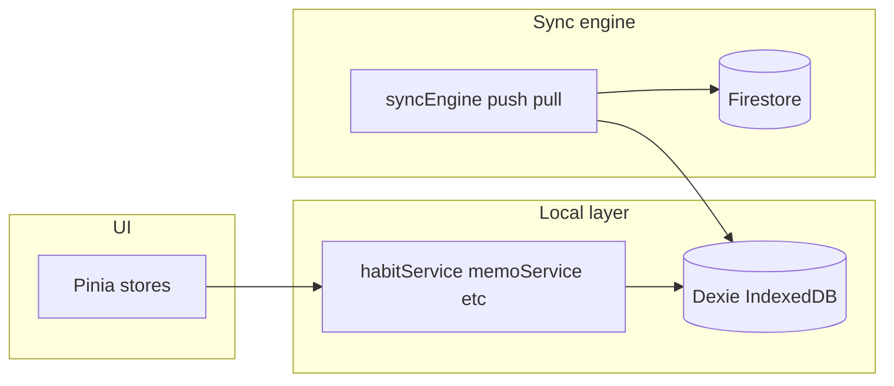

# IndexedDB + Pinia → Firestore sequential sync

## Current state (what you already have)

- **Dexie** is defined in [`src/db.js`](src/db.js) with tables `habits`, `progress`, `pauses`, `memos`, `photos`, etc. Versions 2–3 already index `syncStatus` and `updatedAt` on the main habit-related tables.
- **Pinia** (not only Vuex): [`src/store/habitStore.js`](src/store/habitStore.js) and [`src/store/memoStore.js`](src/store/memoStore.js) call **local services** only — good separation. [`package.json`](package.json) includes both Pinia and Vuex; habit flows are already on Pinia + [`src/services/habitService.js`](src/services/habitService.js) / [`src/services/memoService.js`](src/services/memoService.js).
- **Firebase** is initialized in [`src/firebase.js`](src/firebase.js). [`src/services/syncService.js`](src/services/syncService.js) only **pulls** from Firestore once per browser, keyed by `localStorage` (`photo-migration-complete-${userId}`), then `bulkPut` into Dexie — **no push**, **no incremental pull**, and the flag name is misleading for true multi-device sync.
- **Gaps vs your spec**: [`habitService.deleteHabitFull`](src/services/habitService.js) and [`memoService.deleteMemo`](src/services/memoService.js) **hard-delete**; [`updateProgress`](src/services/habitService.js) **hard-deletes** progress when cleared; pause mutations do not consistently set sync metadata; `updatedAt` is stored as `Date` in many paths while Firestore often uses `Timestamp` — LWW needs one comparable type (recommend **numeric ms** end-to-end in Dexie + Firestore `number` fields for simplicity with `where('updatedAt', '>', cursor)`).

## 1. Data model and Dexie migration

- Add **`isDirty: boolean`** (local-only): treat as source of truth for “needs push”. You can **migrate** existing `syncStatus === 'pending'` → `isDirty: true` and `'synced'` → `false` in a one-time upgrade step to avoid rewriting every call site at once.
- Add **`isDeleted: boolean`** (default `false`) on every collection you sync (`habits`, `progress`, `pauses`, `memos`). **Never hard-delete** those rows until a future optional cleanup job after successful push (or keep tombstones indefinitely for simplicity).
- Standardize **`updatedAt`**: store **`Date.now()`** (number) on every mutation; when reading from Firestore, normalize `Timestamp` / `Date` / legacy forms to ms once in a small helper (extend the existing `convertToDate`-style logic in [`syncService.js`](src/services/syncService.js) or move to `src/utils/firestoreConverters.js`).
- Keep **`id`**: already UUID-style via [`generateId`](src/utils/generateId.js) / `crypto.randomUUID()` in [`habitStore.addHabit`](src/store/habitStore.js). Use **the same string as the Firestore document id** (`doc(db, 'habits', id)`) so push/pull are idempotent without separate id mapping.
- **`userId`**: keep on each document for security rules and queries (already present in services).
- **Cursor**: persist **`lastSyncedAt`** (number, ms) per user in the existing **`settings`** table (e.g. key `lastSyncedAt:<uid>`), not `localStorage`, so it survives clears and matches “app state” better than the current migration flag.

Bump **Dexie version** (e.g. v4) in [`src/db.js`](src/db.js): add indexes needed for efficient dirty queries, e.g. **`[userId+isDirty]`** or at least `isDirty` plus in-app filter by `userId` if table sizes stay small.

**Photos**: [`photos`](src/db.js) table holds local blobs — **do not** push blobs to Firestore. Continue syncing **habit `imageUrls` / Storage URLs** only; local photo rows can stay device-local or use a separate “attachment sync” later.

## 2. Local service changes (Pinia stays dumb about Firestore)

Centralize metadata in **service layer** only (habit + memo + any code touching `progress` / `pauses`):

| Area | File | Change |
|------|------|--------|
| Habits | [`habitService.js`](src/services/habitService.js) | `addHabit` / `updateHabitDetails` / `toggleHabitPause` (and any pause row writes): set `updatedAt`, `isDirty: true`. **`deleteHabitFull`**: transaction that sets `isDeleted: true`, `isDirty: true` on the habit **and** cascade tombstone related `progress` + `pauses` rows (same `habitId`). UI queries filter `!isDeleted`. |
| Progress | same | Replace `db.progress.delete` when progress goes to 0 with **tombstone** (`isDeleted: true`, `isDirty: true`, `updatedAt`) or keep row with `progress: 0` per your product preference; tombstone matches delete semantics across devices. |
| Memos | [`memoService.js`](src/services/memoService.js) | Same pattern for delete; all writes set `isDirty` + `updatedAt`. |
| Reads | `fetchHabits`, `fetchHabitMetrics`, `memoService.fetchMemos` | Filter out `isDeleted` (and ensure metrics ignore deleted habits/progress). |

[`habitStore.updateHabit`](src/store/habitStore.js) currently passes `syncStatus: 'pending'` — either remove in favor of service-owned `isDirty` or have the service ignore store-supplied flags and always set canonical metadata.

## 3. Sync engine (new module)

Add something like [`src/services/syncEngine.js`](src/services/syncEngine.js) (or split `pushSync.js` / `pullSync.js`) that **only** talks to Dexie + Firestore:

**Push**

- On `window` `'online'`, debounced timer (e.g. 5–10s while document visible), and optionally after successful login: query Dexie for rows with `isDirty === true` and `userId === uid`, per collection, cap **500 ops** per Firestore `writeBatch`.
- For each doc: `setDoc(docRef, sanitizeForRemote(payload), { merge: true })` or batch `set` — **strip** `isDirty` from remote payload; include `isDeleted`, `updatedAt` (number), `userId`.
- On batch commit: set **`isDirty: false`** on those exact rows in Dexie (same transaction per table if possible).

**Pull**

- On **app startup** (after auth), and on **`visibilitychange`** to visible: read `lastSyncedAt` from `settings` (default `0` for first run).
- Query each collection: `where('userId', '==', uid)` **and** `where('updatedAt', '>', lastSyncedAt)` — requires **Firestore composite indexes** (one per collection: `userId` ASC, `updatedAt` ASC). Deploy indexes via Firebase console or `firestore.indexes.json` when you add the file.
- For each remote doc: compare `updatedAt` with local row by `id`; **LWW**: if remote newer, `put` into Dexie with `isDirty: false` (and map types). If local is dirty and newer, skip overwrite (sequential usage makes this rare).
- After successful pull: set `lastSyncedAt` to **`Date.now()`** (or max seen `updatedAt` — slightly more precise if you want to avoid clock skew edge cases).

**Initial / legacy behavior**

- Replace or narrow [`syncService.fetchAllFromFirebase`](src/services/syncService.js): the current **full dump** can remain as a **one-time legacy migration** for accounts that still have Firestore-as-source-of-truth and empty Dexie, **or** be superseded by “pull all” once (`lastSyncedAt === 0` → run a full `getDocs` by `userId` then set cursor). Pick one path to avoid double logic.

## 4. App wiring

- [`src/App.vue`](src/App.vue): after `userStore.fetchUser()`, start the sync engine (register online + visibility listeners, kick off initial pull + push). **Remove or reorder** the unconditional `syncService.fetchAllFromFirebase` so it does not fight incremental sync (e.g. only run legacy migration if Dexie is empty and Firestore has data).
- Optionally expose a tiny **Pinia `syncStore`** for UI (“syncing / last error”) — still no Firestore imports in `habitStore`.

## 5. Security and consistency

- Repository has **no** [`firestore.rules`](firestore.rules) checked in; you will need rules like: allow read/write only if `request.auth.uid == resource.data.userId` (and same on create). Without this, client sync is unsafe.
- Ensure **all** synced writes include **`userId`** so rules and queries stay correct.

## 6. Testing checklist (manual)

- Device A: create habit → goes dirty → online → appears in Firestore with same `id`.
- Device B: cold load → pull shows habit.
- Device A: soft-delete habit → push → Device B pull hides habit (tombstone).
- Progress check/uncheck across devices with sequential use.
- Airplane mode: queue dirty rows → online → single batch clears dirty flags.

## Scope note

You asked for Pinia alignment: **no Pinia → Firestore imports**; only extend **services + new sync engine + Dexie schema + App bootstrap**. Legacy [`src/store/index.js`](src/store/index.js) (Vuex) is out of scope unless you still use it for habit screens — grep shows habit flows are already on Pinia services.
