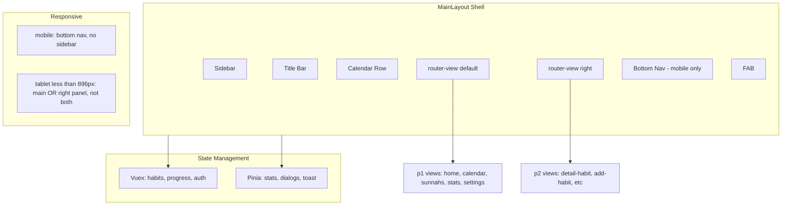

# BitByBit - Agent Guide

## Project Overview

- **Name:** BitByBit
- **Type:** Habit-tracking PWA (Progressive Web App)
- **Stack:** Vue 3, Vite 5, Firebase (Auth + Firestore), Tailwind CSS, Vuex + Pinia
- **Deploy:** Firebase Hosting (project: `bitbybit-5afe4`)

---

## Architecture

- **Named views:** `default` (main content), `right` (detail/edit panel)
- **Responsive:** Mobile = bottom nav only; tablet (&lt;896px) = show either main OR right panel, not both

---

## Directory Structure

| Path | Purpose |
|------|---------|
| `src/views/p1/` | Main list/grid views |
| `src/views/p2/` | Detail/add/edit views (right panel on desktop) |
| `src/views/auth/` | login, register, forgot-password |
| `src/components/` | Shared UI (layout, calendar, habit components, dialogs) |
| `src/store/` | Vuex (`index.js`) + Pinia (`statStore`, `dialogStore`, `toastStore`) |
| `src/utils/` | `getTotalProgressDay.js`, `getTotalProgressDayForMonth.js`, `pushNotifications.js` |
| `src/router/index.js` | Route definitions and auth guard |
| `src/firebase.js` | Firebase init and exports |
| `src/main.js` | App entry point |

---

## View Convention (p1 / p2)

- **p1** = main view (home-p1, calendar-p1, sunnah-p1, stats-p1, settings-p1)
- **p2** = detail/add/edit view (add-habits-p2, detail-habit-p2, detail-sunnah-p2, calendar-p2, settings-*)
- On desktop: p2 renders in the right panel via named view `right`
- Navigation to p2 without `from` (e.g. refresh) redirects to parent (handled in router guard)

---

## Routing and Auth

- **Auth guard:** `meta.requiresAuth`; unauthenticated users redirect to `/login`
- **Refresh handling:** Direct access to detail routes without `from` triggers redirect:
  - `detail-habit`, `edit-habit` → home
  - `detail-sunnah`, `add-sunnah` → sunnahs
  - `detail-stats` → stats
  - `calendar-p2` → calendar
- **Admin routes:** `/admin/sunnahs`, `/admin/news` — no auth guard
- **Route params quirk:** Paths like `detail/:habitId:timestamp` and `stats/:habitId:timestamp` use no slash between params. Pass `params: { habitId, timestamp }` when navigating.

---

## State Management

### Vuex (`src/store/index.js`)

- Habits, week progress, day habits, memos, auth, loading, pauses, sunnahs, selection state
- **Persisted (vuex-persistedstate):** `user`, `isAuthenticated`, `sortType`, `pushNotiGranted`
- Firestore listeners with unsubscribes; batching by 30 items for Firestore `in` query limits

### Pinia

- **statStore:** selectedStat, selectedMonth/Year, habitsCache, progressUpdated, color mapping
- **dialogStore:** confirm, add-memo, view-memo, sort-habits, youtube, spotify, reminder dialogs
- **toastStore:** toast queue (max 1 visible)

---

## Firebase / Firestore

**Collections:**

- `habits` — user habits
- `progress` — daily progress entries (habitId, timestamp, progress)
- `memos` — daily memos (categories: feeling, gratitude, deeds, highlight, other)
- `sunnahs` — curated sunnah habits
- `pauses` — habit pause periods
- `news` — admin news
- `users/{uid}` — user metadata
- `users/{uid}/metadata/news` — last read news
- `users/{uid}/tokens/{deviceId}` — FCM tokens

**Key patterns:**

- `where('habitId', 'in', batchIds)` with batches of 30 (Firestore limit)
- `Timestamp.fromDate()` for dates
- Listeners return unsubscribes; always clean up

---

## Key Utils

- **getTotalProgressDay.js** — Computes day habits with progress, respects repeats, term start/end, pauses
- **getTotalProgressDayForMonth.js** — Same logic for month view
- **pushNotifications.js** — FCM token handling, `users/{uid}/tokens/{deviceId}`

---

## Styling

- **Tailwind:** `tailwind.config.js` with safelist for dynamic habit colors
- **Safelist colors:** red, green, blue, yellow, pink, violet, emerald, orange (300, 400, 500, borders, rings, text, fill, accent)
- **Accent:** `violet-400` as primary
- **Icons:** Material Icons, Font Awesome (CDN)
- **Root:** `index.html` uses `class="dark"`
- **Legacy:** `style.css` has base styles that may overlap with Tailwind

---

## Component Naming and Script Style

- Components: kebab-case (e.g. `calendar-row.vue`, `habitpb.vue`)
- Views: `*-p1.vue`, `*-p2.vue`
- Mix of Options API and Composition API (`script setup` in some components)

---

## Known Quirks and Technical Debt

- **Vuetify:** Present in dependencies but only an unused import (e.g. `habitpb.vue` imports from `vuetify/locale` but never uses)
- **Route path format:** `detail/:habitId:timestamp` (no slash between params)
- **Admin routes:** No auth guard
- **Service worker:** FCM registration is commented out in `main.js`
- **Sentry:** Configured for errors, performance, and session replay

---

## Build and Run

- `npm run dev` — Vite dev server
- `npm run build` — Output to `dist/`
- `npm run preview` — Preview production build
- Firebase Hosting: SPA rewrite `** → /index.html`
